# How to add "skin/theme"
- Download [skin pack 0.zip](./0.zip)
- Place your art to the transparent placeholder in the pack. *Do not change dimensions or names of the files.*
- Submit PR
- Assign it to @kezlya

## 1. Fire Ant

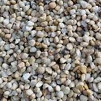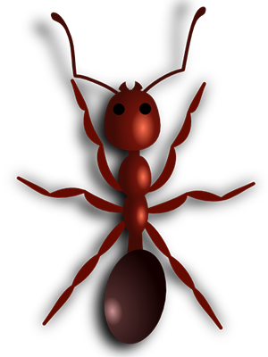
- In Game 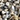 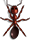
- Events: 

## 2. Albino Ant

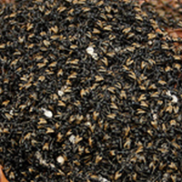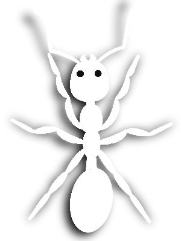
- In Game  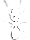
- Events: 

## 3. Rick

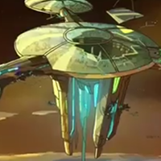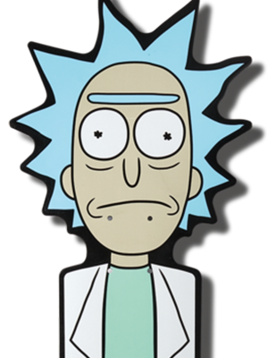
- In Game 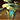 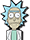
- Events: 

## 4. Morty

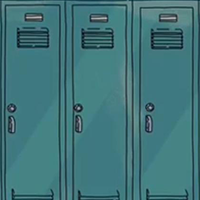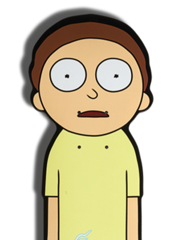
- In Game  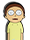
- Events: 

## 5. Galactic Federation

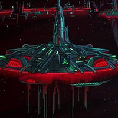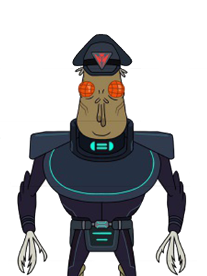
- In Game 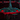 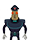
- Events: 

## 6. Ant man

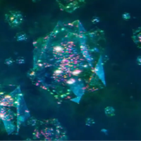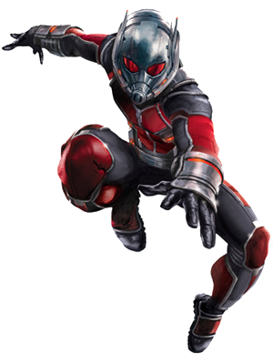
- In Game 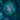 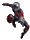
- Events: 

