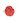
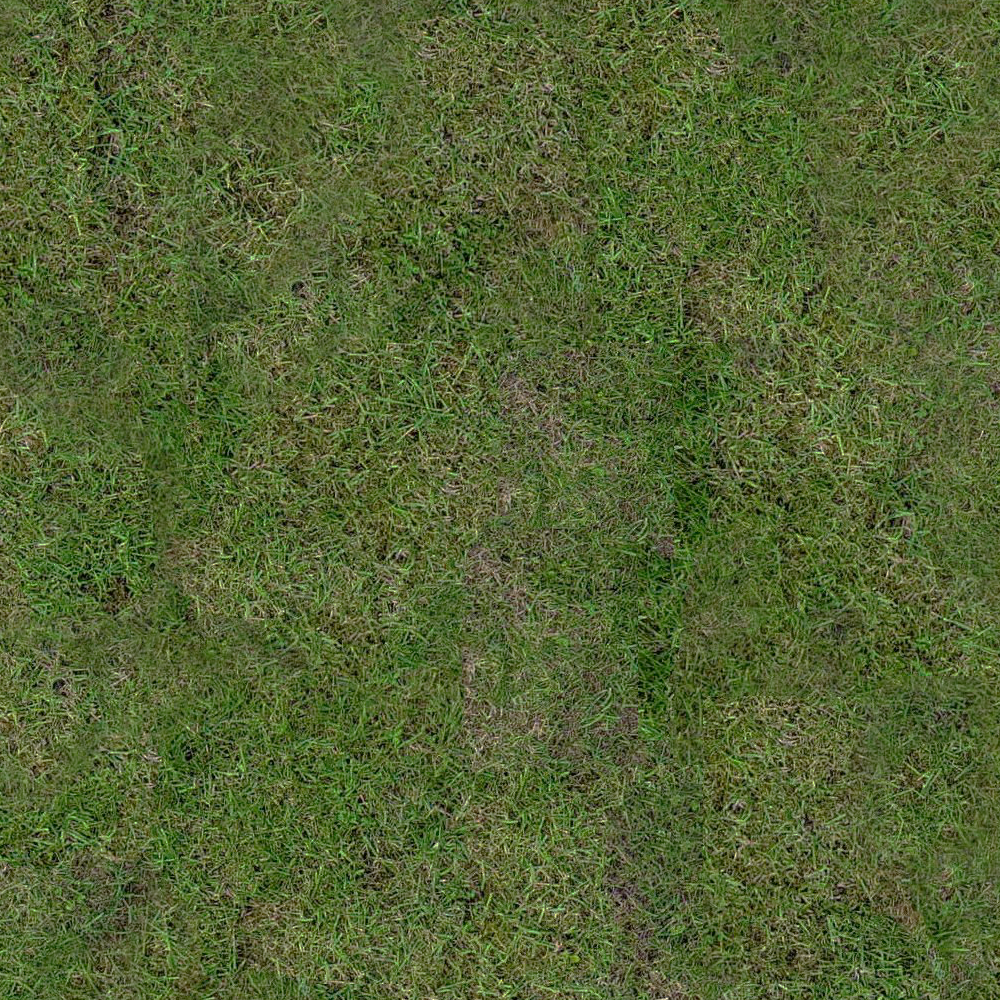
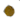
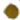
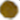
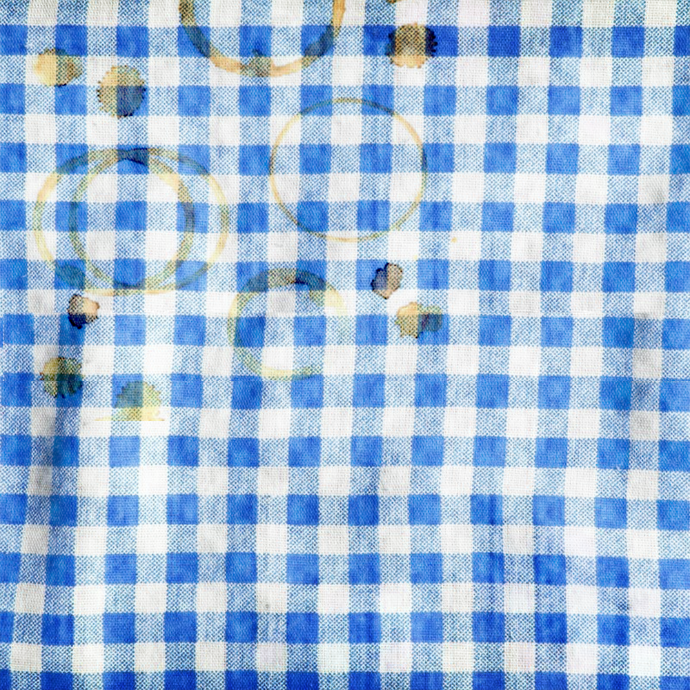
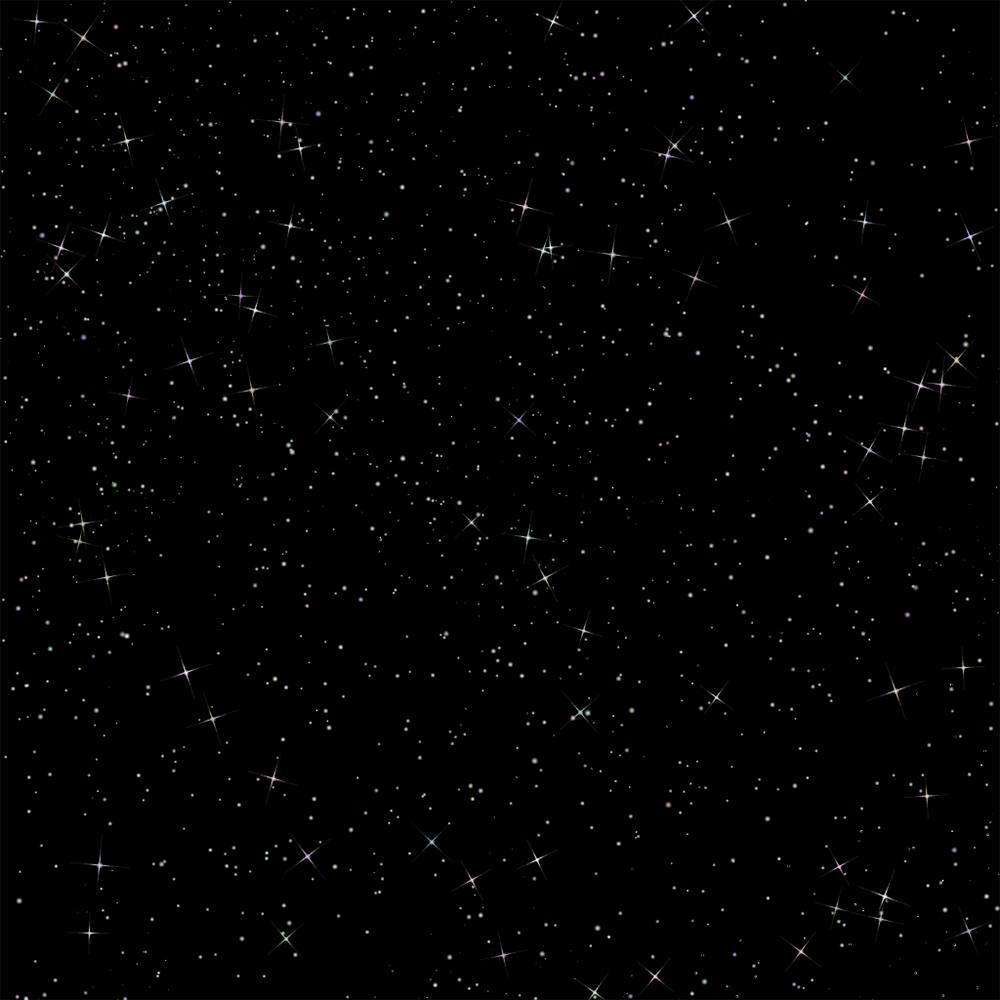
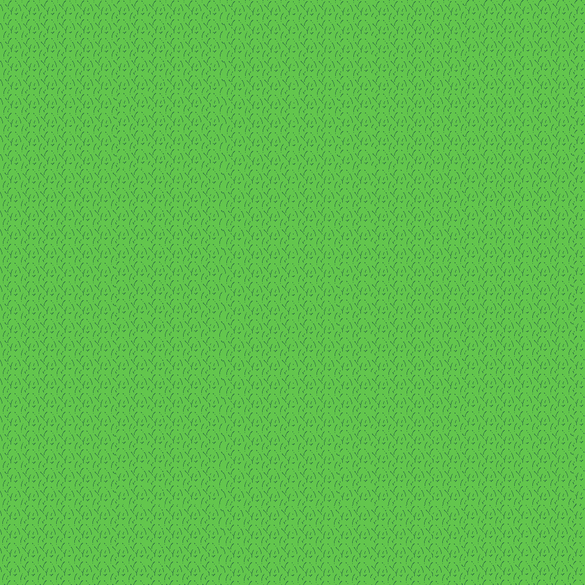

# How to add "skin/theme"
- Download [theme pack 0.zip](./0.zip)
- Place your art to the transparent placeholder in the pack. *Do not change dimensions or names of the files.*
- Submit PR
- Assign it to @kezlya

## 1. Grass
### Food:   

## 2. Sand
### Food:   

## 3. Picnic
### Food:   

## 4. Space
### Food:   

## 5. green-fodder
### Food:   

